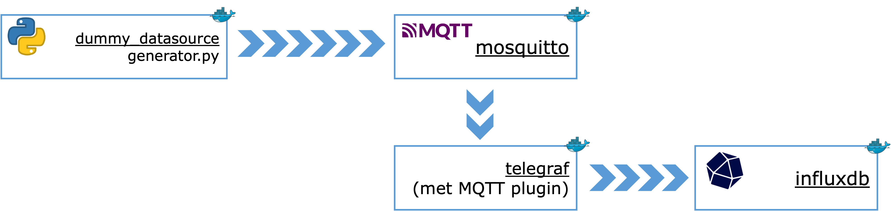
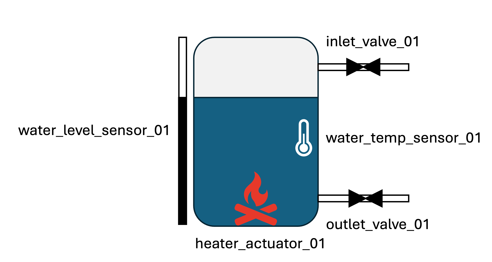

# Time series database oefeningen

## Setup

1. Ga in een Command prompt naar de folder waarin deze README staat.

> Navigeren naar een folder kan je doen met het commando `cd`.
> Tip: gebruik de Tab-toets om het pad aan te vullen.
> 
> Bijvoorbeeld, als je naar de folder `C:\Users\me\Downloads\03-timeseries` wil gaan, 
> en je staat al in `C:\Users\me`, dan typ je `cd Downloads\03-timeseries`.
> Het volstaat waarschijnlijk om `cd Dow<tab>\03<tab>` te typen.
>
> Indien je naar de bovenliggende folder wil gaan, typ je `cd ..`. Bijvoorbeld, als je in `C:\Users\me\Downloads\03-timeseries` staat en `cd ..` typt, ga je naar `C:\Users\me\Downloads`.

2. Start alle Docker containers via
`docker compose up --build` in de folder van deze README. Dit start 4 containers die met mekaar communiceren, namelijk
- Dummy datasource (een Python-script dat data genereert en verstuurt via MQTT)
- Mosquitto (een lokale MQTT broker)
- Telegraf (een agent om data uit MQTT in te voegen in de database)
- InfluxDB (de time series database)



> Het --build argument zorgt ervoor dat, als je de python-code van de generator aanpast, de image elke opnieuw gebouwd wordt voor de container gestart wordt.

> Als je later opnieuw wil beginnen met de originele database,
> - stop je de database (Ctrl-C)
> - verwijder je de folder `influxdb2_data` die aangemaakt wordt
> - start je de database opnieuw (`docker compose up`)
> De originele database wordt dan opnieuw aangemaakt.

## Oefeningen

### Oefening 1

De data-generator simuleert een systeem om water te verwarmen.



Bekijk de Python-broncode van de [data-generator](./dummy_datasource/generator.py). Zorg dat je (minstens in grote lijnen) begrijpt wat er gebeurt.

Hoeveel sensoren en actuatoren zijn er die data aanleveren?


> **Oplossing**
> 
> Er zijn 2 sensoren (`water_level_sensor_01` en `water_temp_sensor_01`) en 3 actuatoren (`inlet_valve_01`, `outlet_valve_01`, `heater_actuator_01`) die data aanleveren via MQTT.

### Oefening 2

Bekijk het bestand [`telegraf.conf`](telegraf.conf) in deze folder (dat kan met [VS Code](https://code.visualstudio.com/), PyCharm, of een andere gewone teksteditor). Wat wordt er in dit bestand geconfigureerd?
Kan je terugvinden hoe de data uit MQTT omgezet wordt in fields en tags?

> **Oplossing**
> 
> Telegraf is de agent die gegevens uit de MQTT broker haalt en in InfluxDB stopt.
>
> In de sectie `inputs.mqtt_consumer` wordt aangegeven welke MQTT server gebruikt wordt, en naar welke topics geluisterd zal worden.
>
> In de sectie `inputs.mqtt_consumer.topic_parsing` wordt aangegeven hoe de verschillende delen van het MQTT topic vertaald worden in tags. Voor een MQTT topic `factory/site1/sensor/temp_sensor_01/temperature` wordt
> - `factory` gebruikt als measurement-naam in InfluxDB
> - `site1`, `sensor` en `temp_sensor_01` als tags (`site`, `type`, en `deviceid`, respectievelijk)
> 
> In de sectie `inputs.mqtt_consumer.json_v2` wordt aangegeven hoe de JSON-objecten die gepublished worden in het topic omgezet worden in tags en fields:
> - het JSON-veld met naam `unit` wordt een tag
> - de JSON-velden met naam `value` (voor sensoren) of `state` (voor actuatoren) worden een field

### Oefening 3

1. Surf naar [http://localhost:8086](http://localhost:8086) en login als `admin` met wachtwoord `password`.
2. Ga naar de 'Data Explorer' tab, en zet 'View Raw Data' aan.
3. Klik op 'SCRIPT EDITOR'.
4. Doe een query om alle data van de laatste 30 seconden te bekijken:
```flux
from(bucket: "timeseries")
|> range(start: -30s)
```

> **Oplossing**
>
> Je ziet nu alle data van de laatste 30 seconden in tabelvorm.

### Oefening 4

Hoeveel tabellen zitten er in het resultaat van oefening 3? (Kijk naar de eerste kolom in het resultaat)

> **Oplossing**
>
> Er zijn 5 tabellen (genummerd van 0 tot en met 4), namelijk 1 voor elk van volgende combinaties:
> - `_field="value", device="water_temp_sensor_01"`
> - `_field="value", device="water_level_sensor_01"`
> - `_field="state", device="inlet_valve_01"`
> - `_field="state", device="outlet_valve_01"`
> - `_field="state", device="heater_actuator_01"`
> 
> (De andere tags zijn constant of variëren steeds mee met de device-tag, dus leveren geen extra combinaties op).

### Oefening 5

Maak een query die de gemiddelde waarde van *alle sensoren* van de laatste 30 seconden teruggeeft.

> **Oplossing**
>
> ```flux
>from(bucket: "timeseries")
>|> range(start: -30s)
>|> filter(fn: (r) => r.type == "sensor" and r._field == "value")
>|> mean()
>```

### Oefening 6

Maak een query die, van de laatste 5 minuten in periodes van 30 seconden, de gemiddelde waarde van *alle sensoren* teruggeeft.

> **Oplossing**
>
> ```flux
>from(bucket: "timeseries")
>|> range(start: -5m)
>|> filter(fn: (r) => r.type == "sensor" and r._field == "value")
>|> aggregateWindow(every: 30s, fn: mean)
>```

### Oefening 7

Maak een query die, van de laatste 5 minuten in periodes van 30 seconden, de gemiddelde temperatuur gemeten door `water_temp_sensor_01` in elk van die periodes teruggeeft.

> **Oplossing**
>
> ```flux
>from(bucket: "timeseries")
>|> range(start: -5m)
>|> filter(fn: (r) => r.deviceid == "water_temp_sensor_01" and r._field == "value")
>|> aggregateWindow(every: 30s, fn: mean)
>```


### Oefening 8

Zet 'View Raw Data' uit. Je ziet nu het resultaat als een grafiek in plaats van als een tabel.

### Oefening 9

Maak een query (en grafiek) die het *moving average* van het waterniveau weergeeft, telkens gebaseerd op de laatste 10 metingen.

> **Oplossing**
>
>```flux
>from(bucket: "timeseries")
>|> range(start: -1h)
>|> filter(fn: (r) => r.deviceid == "water_level_sensor_01" and r._field == "value")
>|> movingAverage(n: 10)
>```
> 
> De opgave vermeldde niet hoe lang in de tijd we terug moesten gaan, maar `range` is vereist. We kozen hier 1 uur.

### Oefening 10

InfluxDB heeft ook een makkelijkere manier om queries te bouwen.
1. Klik op 'QUERY BUILDER'.
2. Kies 
    - bij FROM de **timeseries** bucket
    - een filter '_measurement' met waarde **factory**,
    - een filter 'type' met waarde **sensor**,
    - en een filter '_field' met waarde **value**.

    Zet verder ook
    - het klokje (naast 'SCRIPT EDITOR') op **Past 15m**,
    - 'Window period' (rechts) op **Custom 5s**,
    - en tenslotte 'Aggregate function' op **mean**.

3. Druk op submit en bekijk het resultaat.
4. Bedenk welke query je hier uitvoert. 

> **Oplossing**
>
> Deze query geeft alle sensorwaarden van de voorbije 15 minuten terug, waarbij de waarden telkens het gemiddelde zijn van de vorige 5 seconden. Dit komt overeen met volgende query:
>```flux
>from(bucket: "timeseries")
>|> range(start: -15m)
>|> filter(fn: (r) => r._measurement == "factory")
>|> filter(fn: (r) => r.type == "sensor")
>|> filter(fn: (r) => r._field == "value")
>|> aggregateWindow(every: 5s, fn: mean)
>```